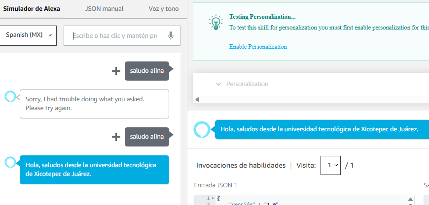
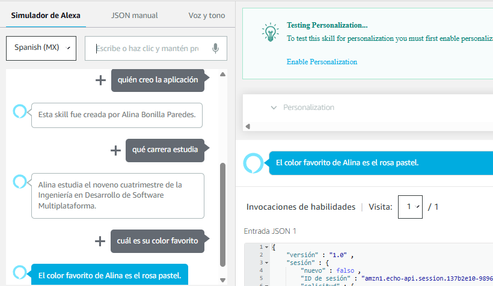
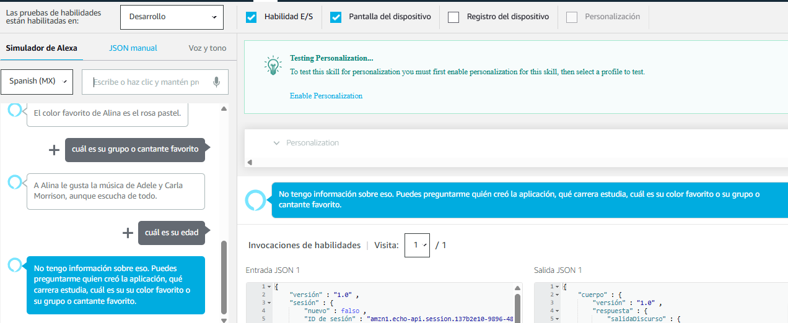
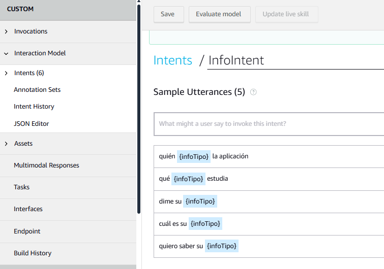

  
  

## UNIVERSIDAD TECNOLÓGICA DE XICOTEPEC DE JUÁREZ 

**MATERIA:** Extracción de Conocimiento de Bases de Datos  
**ALUMNA:** Alina Bonilla Paredes  
**MATRÍCULA:** 220385  

### Práctica 03: Funcionalidades por Comandos de Voz

Este repositorio contiene el código fuente de una skill básica para Alexa, desarrollada a través de la plataforma Amazon Developer. La invocación de la skill es **"Saludo Alina"**.

---

### 🗣️ ¿Qué hace esta skill?

Una vez invocada, la skill está diseñada para responder a las siguientes preguntas de manera personalizada:

- ¿Quién creó la aplicación?
- ¿Qué carrera estudia?
- ¿Cuál es su color favorito?
- ¿Cuál es su grupo o cantante favorito?

---

### 🛠️ Tecnologías utilizadas

- AWS Lambda (Node.js)
- Alexa Skills Kit (ASK)
- Amazon Developer Console

---

### Imágenes

  

